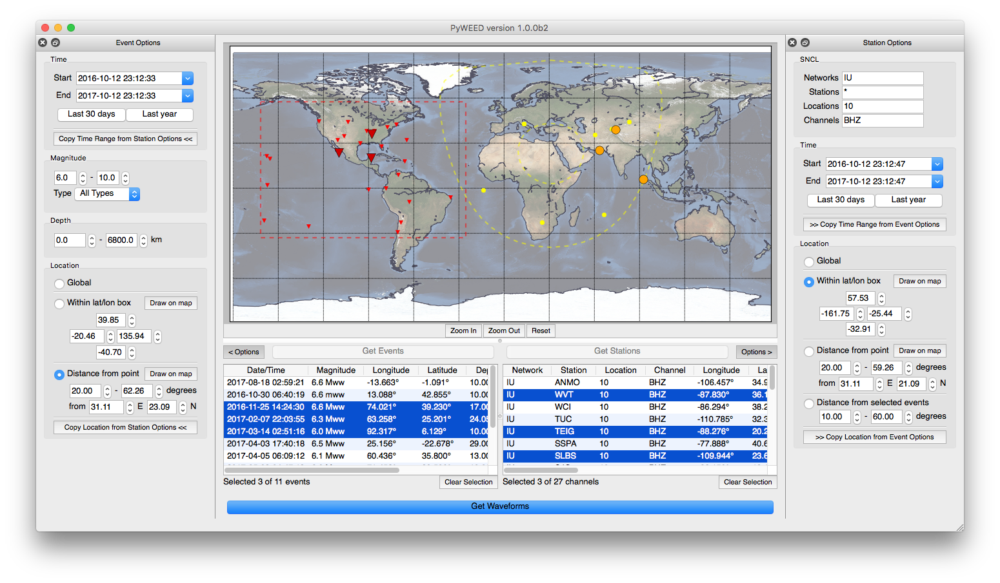
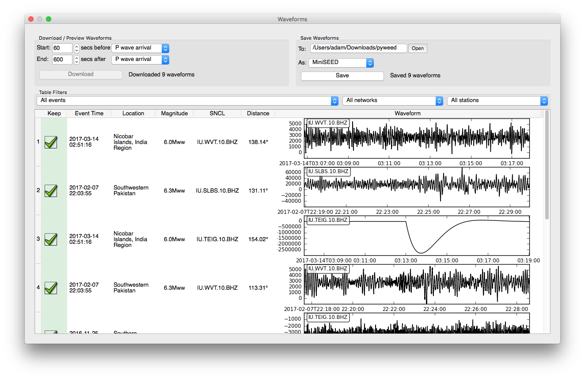

## About PyWEED

PyWEED is an application for retrieving event-based seismic data.

PyWEED works on Windows, Mac, and Linux (64-bit). It is built on [ObsPy](https://obspy.org/) and
[PyQt](https://pypi.python.org/pypi/PyQt4).

[Demo Screencast](https://vimeo.com/246357529) on Vimeo 

## Documentation

__[Installation Guide](Installation.md)__

__[User Guide](UserGuide/index.md)__

__[Support](Support.md)__

Please send comments/problems to pyweed@iris.washington.edu.

---

[Developer Docs](Developer.md)
