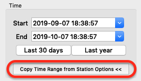
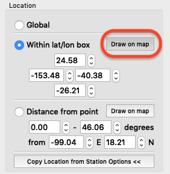
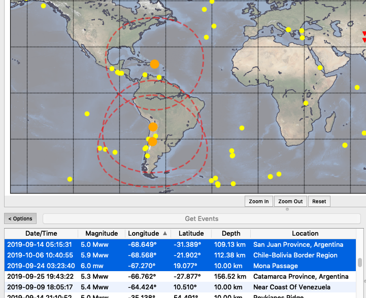
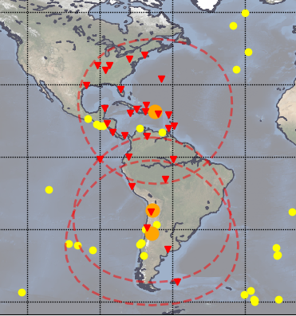

# Event and Station Query Options

More about the "Event Options" and "Station Options" controls.

## Copy Options

In many cases, events and stations should use the same basic query values -- for example, if you're looking at events during a certain time period, you probably want to see the active stations from the same time period.

## Draw Bounding Regions on the Map

Bounding boxes and circular areas can be drawn on the map. Just click the "Draw on map" button, then click and drag on the map to define a region.

**Note** that drawing a "Distance from point" defines only the *maximum* distance from a point. The filter allows a *minimum* distance to be set as well, but this is entered manually.

## Find Stations Based on Selected Events

This is a variation on filtering based on distance from a point, which finds stations based on distance from any of the selected events.

Here 3 events have been selected, and the station filter is set to 0&deg; - 30&deg; from selected events. This bounding radius is shown for each selected event.

Running the station query shows that only stations within this bounding area were retrieved.

